# 🌎GPTWorld: an experimental multi-agent sandbox world.


🌎GPTWorld is an experimental multi-agent sandbox world. 🔬 Unlike typical sandbox games, interactions in GPTWorld are not defined by pre-written scripts 📜, but rather **inferred by a world engine based on large models 🤖.** In this world, virtual agents and objects can act, react, interact, and communicate autonomously, all supported by AI 🤯.

🛠️ To facilitate the creation of a more diverse range of sandboxes, we aim to allow players to create custom worlds through simple configuration files or even natural language 🤩, and look forward to building a rich sandbox world for intelligent agents to explore through community sharing 🤝.

👨‍💻👩‍💻 Join us on this exciting journey of creating a groundbreaking sandbox world with limitless possibilities 🚀!


**Currently, 🌍GPTWorld supports:**

👨‍💻 Easily creating your environment and entities using JSON and mounting them onto your world
🏃 Starting the environment's autonomous operation with just one command
👀 Observing the behavior of the agent in your web browser

🎉 **Coming soon:**
🤝 Allowing players to build and share environments in a distributed way
🗣️ Creating environments with natural languages

🙏**Acknowledgements:** This project was greatly inspired by [*Generative Agents: Interactive Simulacra of Human Behavior*](https://arxiv.org/abs/2304.03442)  during development, where the mechanism of agents' behavior takes the reflection-summary-plan framework.

🧪 **Disclaimer:**
This project is for academic and experimental purposes only. We currently suspect that it is far from a usable game product.


<br/>
<br/>

# System Design

Here is the architecture of GPT-World.



As a host, you can deploy core simulator on your host, then launch a backend. 

- For yourself, you could go to `http://localhost:5001` to view your world. 

- Others could use `http://{Your IP Address}:5001` to access your world remotely. 

All people could view the simulation results in an interactive way, and even give commands to characters in your world, upload their own characters, etc. 

As a developer, if you would like to modify GPT-World to fit your need, you could read the scripts in the corresponding directory.


|Module Name|Script Directory|
|--|--|
|User Client|`./io/frontend/`|
|Backend|`./io/`|
|File Storage|`./static_files/`|
|Core Simulator|`./gptworld/core/`|
|Environment Generating Tool|`./environment_creation_tool/`|

<br/>
<br/>

# Normal User Setup

If you would like to get started as a host, just do the following steps:

Apply an OpenAI API key, then export it to environment

```bash
export OPENAI_API_KEY='sk-'
```

Then install python and dependencies. It is recommended to use `python==3.8`.

```bash
# Create a virtual environment with python==3.8
conda create -n gptworld python=3.8

# Activate the environment
conda activate gptworld

# Install dependencies
pip install -r requirements.txt

# Install gptworld on the spot
pip install -e .
```

Run GPT-World Core Simulator

```bash
python gptworld/run.py --world_instance alice_home
```

Launch a backend server

```bash
cd io
python app.py --world_instance alice_home
```

Open your browser, go to `http://localhost:5001`

