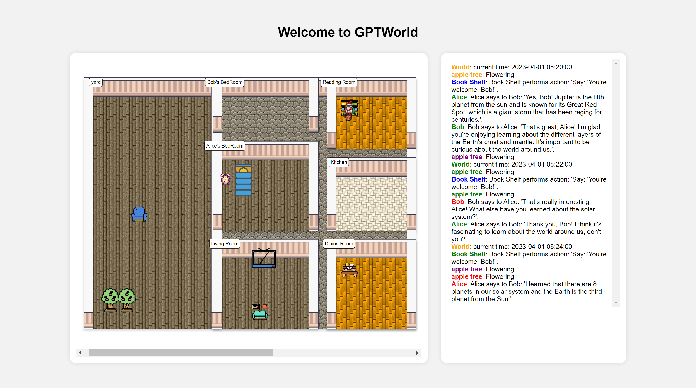

>[!warning] 
>This project has been archieved! Please use [AgentVerse](https://github.com/OpenBMB/AgentVerse) instead. Thanks for your interest and let's fight for the future that autonomous agent live in the game sandbox!

# 🌎GPTWorld: An Experimental AI-engined Sandbox World



**NOTE:** We are now integrated into [AgentVerse](https://github.com/OpenBMB/AgentVerse)! 

🌎**GPTWorld** is an experimental **multi-agent sandbox** world.  Unlike typical sandbox games, interactions in GPTWorld are not fully defined by pre-written scripts 📜 and rules📏, but rather **inferred by a world engine based on large models 🤖**. In this world, the whole environment, including agents and objects, is supported by large models, providing great autonomy and diversity.

The **creation of a sandbox world** is often considered to require advanced game development techniques that are beyond the reach of most individuals. This is where 🌎GPTWorld comes to the rescue! 🛠️ Our goal is to make the process of creating a diverse range of sandboxes more accessible by enabling players to construct custom worlds using simple configuration files or even **natural language** 🤩.

Through this easy-to-use **world creation** feature, we hope to inspire **everyone** to construct their **own unique** worlds. As a result, a vibrant sandbox environment community will emerge, allowing intelligent agents to explore various creations through community sharing 🤝.

👨‍💻👩‍💻 Join us on this exciting journey of creating a groundbreaking sandbox world with limitless possibilities 🚀!

## Project Status
### 1. Currently, 🌍GPTWorld Supports:

👨‍💻 **Create with JSON:** Easily creating your environment and entities using JSON and mounting them onto your world

🏃 **Start World Engine:** Starting the environment's autonomous operation with just one command.

👀 **Demo:** Observing the behavior of the agent in your web browser.

### 2. Experimental Feature
🗣️ **Create with NL:** Creating environments with natural languages.

### 3. TODOS!
❗️ **Polishing:** Feeling that the current behavior of agents is not very reasonable? Don't worry, we are improving it! 

❗️ **Refactoring:** We are also using [AgentVerse](https://github.com/OpenBMB/AgentVerse) to refactor the behavior of agents!

🤝 **Distributed:** Allowing players to build and share environments in a distributed way.


## Usage

### Installation

We strongly recommend to use `python=3.8` on all platforms.

1. Download project by

```sh
git clone https://github.com/ShengdingHu/GPT-World.git
```

2. (Optional) Create a python virtual enviornment by 

```
conda create -n gptworld python=3.8
```
* Please note that Python 3.8 provides the best support for `flask-socketio`, whereas other versions of Python may currently encounter issues with web display. *

3. Go to project directory by 

```
cd GPT-World
```

4. Install dependencies by

```sh
pip install -r requirements.txt
```

5. Then install this library by

```sh
pip install .
```

6. Build the front end
```sh
cd io/frontend/rpg-game/
npm install
npm run build
```

### Run Examples
We currently provide some example sandboxes in  `world_instances/`, choose one that you want to launch.
Take `alice_home` as an example.

1. start the world engine
```
python gptworld/run.py -W alice_home
```

2. start the web server
```
python io/app.py -W alice_home
```
now open the 5001 port of your localhost(`http://0.0.0.0:5001/`), and you will be able to see a wonderful
environment full of GPT-drived agents and objects!

> If `http://0.0.0.0:5001/` is not working, you may try `http://127.0.0.1:5001/`.

### (🧪Experimental) Create Your Own World
If you want to create your world instance,
run `gptworld/create_world.py -W <world_instance> -I <info>`, where `<world_instance>` stands for the name of the world 
directory in the `./world_instances/` directory, and `<info>` stands for the 
initial information about the world to be created. Remember to add specific information into the `<info>` argument, 
the more detailed, the better.

> e.g. -W neighborhood -I "A neighborhood with some Chinese restaurants (with a cook, tables, chairs, delicious
> foods), and coffee bar (coffee machine, coffee staff), 711 shop (stocks, drinks, snacks, etc), trees, grass area
> (with flower, old people, etc), roads (with some cars, bikes), Alice's house and Bob's house (includes some furniture
> , like sofa, bed, bookshelf, cooker, and their families, a yard with two apple trees, etc), all above should be areas,
> each task could be a subtask, assign the jobs with lots of details, no overlapping areas. Add some people and animals
> and plants, evenly distributed. Expect more details. Areas should not overlap with each other."


[//]: # (modify the requirement in `gptworld/create_world.py` and run)

[//]: # (```)

[//]: # (python gptworld/create_world.py)

[//]: # (```)

## Global Configs
1. Log Level:
```bash
export GPTWORLD_LOG_LEVEL=<log_level>
```
 <log_level> can be DEBUG, INFO, WARNING ...) to set the logging level, DEBUG will have a lot of print in command line :

2. OpenAI Key
```bash
export OPENAI_API_KEY=<your_openai_api_key>
```
`<your_openai_api_key>` refers to your own api key to access to the ChatGPT.

In Windows OS, please add environment variables instead of `export` methods.

## 🙏Acknowledgements

 This project was greatly inspired by [*Generative Agents: Interactive Simulacra of Human Behavior*](https://arxiv.org/abs/2304.03442)  during development, where the mechanism of agents' behavior takes the reflection-summary-plan framework.

## 🚨 Disclaimer:
This project is for academic and experimental purposes only. We currently suspect that it is far from a usable game product.


## Contributor

<a href="https://github.com/ShengdingHu/GPT-World/graphs/contributors">
  
</a>

Made with [contrib.rocks](https://contrib.rocks).
